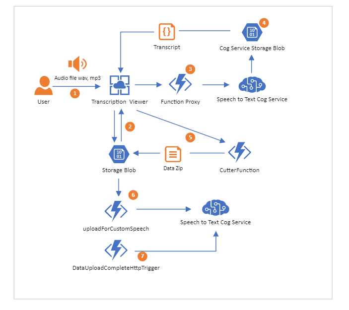

# Speech to Text Accelerator

**Disclaimer**: This content is not officially endorsed by *Microsoft*. This is not end to end solution, rather a starting point for your own azure speech solution. Navigate to [Azure Application Architecture Guide](https://docs.microsoft.com/en-us/azure/architecture/guide/) to learn how to build solutions on Azure that are scalable, secure, resilient, and highly available.

## Introduction
This speech solution was put together to help customers test and use azure cognitive speech services. It has 2 components:
* Transcription Viwerl
* Custom Speech data preparation. 

## Solution Architecture

1. User can upload audio via Transcription vewer portal, view the transcripts/edit the transcript and upload data for custom training;
2. User can select existing audio recordings from the storage account blob or upload a new recording;
3. To not expose the Azure Speech Service keys via Transcription service, the request to cognitive service goes via  azure function proxy;
4. Once the transcription is complete, the viewer surfaces the transcript from cognitive service storage blob;
5. Train button on transcription viewer posts the transcript to Cutter Azure Function which using ffmpeg library prepares the data for custom training and uploads the zip to azure storage;
6. UploadForCustomSpeecg Azure function uploads the audio and text zip as custom speech data set using speech cognitive service.  Once the data is successfully uploaded,  DataUploadCompleteHttpTrigger is triggered and starts training using the custom data set uploaded. 

## Solution Deployment 

The solution is deployed through the Azure Resource Manager. Azure Resource Manager allows you to provision your applications using a declarative template. In a single template, you can deploy multiple services along with their dependencies. You use the same template to repeatedly deploy your application during every stage of the application life cycle. [Learn More](https://docs.microsoft.com/en-au/azure/azure-resource-manager/resource-group-overview).

*  Original deploy via portal.azure.com - working
*  

## Local Development 
Use [ngrock](https://ngrok.com/) to expose DataUploadCompleteTriggrt function as a public url and add the URL to application settings.

#

