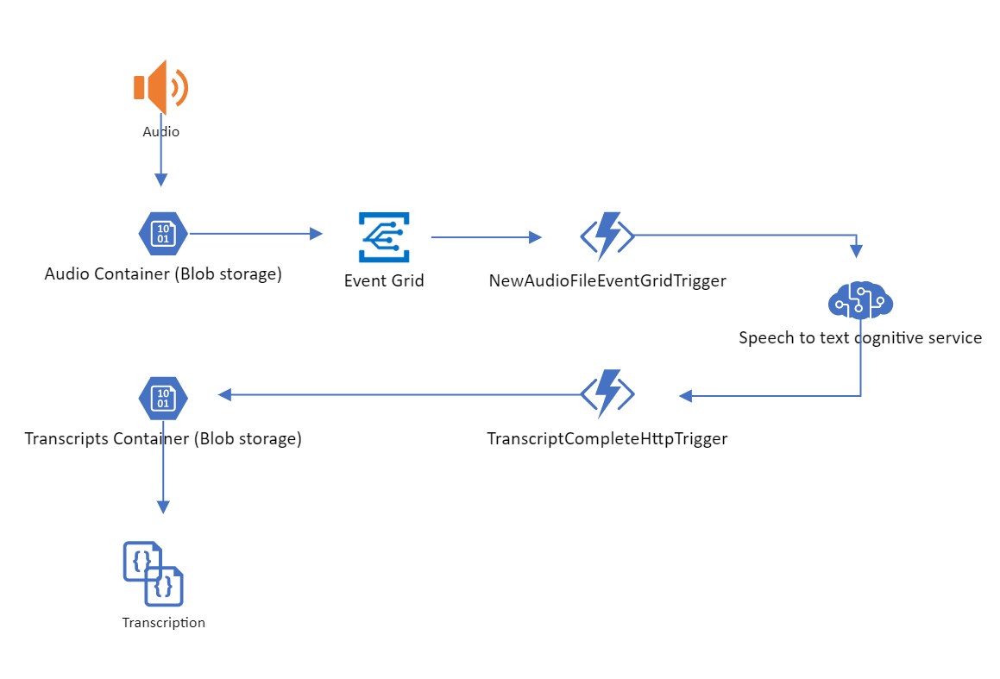

# Speech to Text Batch Transcription Viewer App - Demo

**Disclaimer**: This content is not officially endorsed by *Microsoft*.

## Solution Deployment 

The solution is deployed through the Azure Resource Manager. Azure Resource Manager allows you to provision your applications using a declarative template. In a single template, you can deploy multiple services along with their dependencies. You use the same template to repeatedly deploy your application during every stage of the application life cycle. [Learn More](https://docs.microsoft.com/en-au/azure/azure-resource-manager/resource-group-overview).

*  Original deploy via portal.azure.com - working
*  

## Overview

This solution will get you started with using Speech-to-text cognitive service API to perform batch transaction. Speech Service Batch Transcription is designed to handle a large number of audio fragments in storage, such as Azure Blobs. The solution was built upon an existing Batch Transcription API sample found [here](https://github.com/Azure-Samples/cognitive-services-speech-sdk/tree/master/samples/batch/csharp). The sample was changed from using Console App running locally, to using event driven, serverless architecture pattern with Azure Functions, Event Grid, Webhooks. 

Once solution is deployed you can copy supported audio files (wav, mp3, ogg) to the audio container in the storage account and the solution will automatically queue your file for transcription using speech services. The solution uses batch service webhook, to evoke azure function to pool completed transcripts and store in blob storage, instead of pooling for completion. 

## Solution Architecture

## Technology Choices 
### Speech to text cognitive service
The Speech Services are the unification of speech-to-text, text-to-speech, and speech-translation into a single Azure subscription. It's easy to speech enable your applications, tools, and devices with the Speech SDK, Speech Devices SDK, or REST APIs. [Learn more](https://docs.microsoft.com/en-gb/azure/cognitive-services/speech-service/overview)
#### Batch Transcription 
Batch transcription is ideal if you want to transcribe a large quantity of audio in storage, such as Azure Blobs. By using the dedicated REST API, you can point to audio files with a shared access signature (SAS) URI and asynchronously receive transcriptions. It is a REST API that exposes methods for:
1. Creating batch processing requests
2. Query Status
3. Downloading transcriptions

For stereo audio streams, the Batch transcription API splits the left and right channel during the transcription. The two JSON files with the result are each created from a single channel. The timestamps per utterance enable the developer to create an ordered final transcript. This sample request includes properties for profanity filtering, punctuation, and word level timestamps.

Supported audio formats WAV, MP3, OGG (mono, stereo).

[Batch transcription learn more](https://docs.microsoft.com/en-gb/azure/cognitive-services/speech-service/batch-transcription)

#### Webhooks for Speech Services
Webhooks are like HTTP callbacks that allow your application to accept data from the Speech Services when it becomes available. Using webhooks, you can optimize your use of our REST APIs by eliminating the need to continuously poll for a response. [Learn more](https://docs.microsoft.com/en-us/azure/cognitive-services/speech-service/webhooks). 

**TranscriptionCompletion** operation was used in this solution to evoke azure function to pool completed transcripts. 

### Azure Functions 
Azure Functions is a solution for easily running small pieces of code, or "functions," in the cloud. You can write just the code you need for the problem at hand, without worrying about a whole application or the infrastructure to run it. Functions can make development even more productive, and you can use your development language of choice, such as C#, Java, JavaScript, PowerShell, and Python. Functions is a great solution for processing data, integrating systems, working with the internet-of-things (IoT), and building simple APIs and microservices. Consider Functions for tasks like image or order processing, file maintenance, or for any tasks that you want to run on a schedule. Azure Functions integrates with various Azure and 3rd-party services. These services can trigger your function and start execution, or they can serve as input and output for your code. This solution accelerator used:
* **Azure Event Grid** - **EventHubTrigger**. Respond to events delivered to an Azure Event Hub. Particularly useful in application instrumentation, user experience or workflow processing, and internet-of-things (IoT) scenarios. 
* **HTTPTrigger** - Trigger the execution of your code by using an HTTP request.

[Learn More](https://docs.microsoft.com/en-us/azure/azure-functions/functions-overview)

### Event Grid
Azure Event Grid allows you to easily build applications with event-based architectures. First, select the Azure resource you would like to subscribe to, and then give the event handler or WebHook endpoint to send the event to. Event Grid has built-in support for events coming from Azure services, like storage blobs and resource groups. Event Grid also has support for your own events, using custom topics. [Learn more](https://docs.microsoft.com/en-au/azure/event-grid/)

### Azure Blob storage
Azure Blob storage is Microsoft's object storage solution for the cloud. Blob storage is optimized for storing massive amounts of unstructured data. Unstructured data is data that does not adhere to a particular data model or definition, such as text or binary data.

